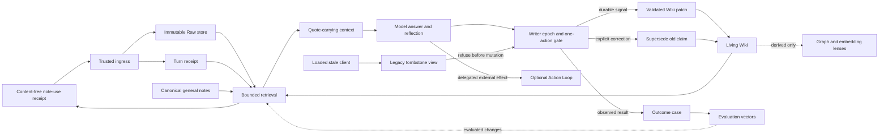

# Architecture

## 1. System boundary

LeeVault separates the cognitive loop from the action loop.

- The **Knowledge Loop** captures, retrieves, reflects, corrects, and evaluates.
- The optional **Action Loop** executes effects only under explicit bounded
  authority, idempotency, and reconciliation contracts.
- **Derived lenses** visualize or traverse knowledge but cannot write truth by
  themselves.

## 2. Core records

### Turn envelope

A trusted surface creates a current-turn envelope containing the user payload,
capture time, surface identity, and idempotency material. A model-created tool
call cannot upgrade itself into trusted user authority.

### Raw object

Raw content is content-addressed and immutable. A manifest records hash, byte
length, media type, capture time, and origin. Semantic projections never replace
the original source.

### Turn receipt

The receipt closes the model's write reach for one turn. It records which Raw
objects, candidate pages, and prior claims were actually served. A later patch
cannot cite an object that was outside that closed reach.

### Capture health receipt

A separate content-free receipt records runtime contract version, a one-way
conversation identifier, surface, mode, success or failure, and latency.
Evaluation samples the first active capture from distinct current-version
sessions whose content origin is trusted direct-user and whose identity is
assured; it does not mix repeated turns, tool-origin calls, old-runtime, shadow,
or malformed rows into release readiness.

### Grounded general note

Not every durable fact is already a structured Living Wiki claim. A canonical
Markdown note may enter the bounded context only with a bounded excerpt and
declared authority metadata: role, status, freshness, and source location. A
title or path alone is discovery evidence, not enough grounding for a strong
judgment.

### Note-use receipt

A content-free note-use receipt records the identifiers of claims and general
notes actually exposed to the model, without copying their text into telemetry.
It makes later citation, correction, and outcome attribution measurable while
keeping note contents in the canonical store.

### Source span

A claim carries a verified byte range or exact quote plus its Raw identifier and
quote hash. Mechanical verification proves that the quoted bytes exist; it does
not prove the interpretation is true.

### Living Wiki claim

A Wiki page is a mutable working projection. Claims have stable identifiers,
source spans, parent claims, status, and optional supersession links. Human prose
outside generated blocks remains untouched.

### Correction and outcome case

A correction supersedes a served claim and creates a hard regression case. An
outcome records an observed result and optional explicit user attribution such as
helped, harmed, changed-answer, or changed-decision. Attribution may refer to
memory served on the current turn or the immediately previous turn, which is the
smallest window that lets a user react naturally after seeing an answer.

## 3. Write path

1. Capture the current user bytes before model inference.
2. Store Raw and create a turn receipt idempotently.
3. Retrieve only a bounded candidate set with quotes.
4. Answer the user.
5. Reflect on the current direct-user message before finishing.
6. Write only when the message explicitly expresses a durable preference,
   decision, correction, or outcome.
7. Validate the writer epoch and one-action lease before touching a semantic
   projection.
8. Validate authority, source reach, page reach, path safety, and atomicity.
9. Update derived search state outside the latency-sensitive prompt path. A full
   rebuild belongs to maintenance, never to a blocking prompt hook. If the index
   is unavailable or incompatible, report degraded retrieval explicitly.

One-off instructions such as “continue” or “summarize this” remain in Raw but do
not become durable Wiki claims.

### Writer epoch cutover

An application restart is not a security boundary. A client may keep an old MCP
process alive after the implementation on disk has changed. The write contract
therefore has a backward-incompatible writer epoch at the mandatory
pre-mutation signal check.

The current implementation writes semantic-action receipts to a current table.
The legacy table name becomes a read-only tombstone view that returns a retired
writer marker for every completed turn. Old code performs its existing
one-action lookup, sees the marker, and aborts before changing the Wiki. Current
code reads the new table and continues normally.

Migration preserves rows from both the legacy table and any known transitional
epoch inside one database transaction. If an ambiguous state cannot be merged
without guessing, initialization fails closed. Stale clients may still capture
Raw and retrieve context; they cannot mutate canonical claims.

Every backward-incompatible semantic-write contract must rotate the writer
epoch again. Retiring only the oldest table does not retire processes loaded
during a later transitional epoch.

## 4. Read path

Retrieval is deliberately bounded. The current default uses SQLite FTS5/BM25
lexical retrieval and evidence/claim relationships, not a mandatory vector DB:

1. lexical search produces candidates; semantic/vector search is an optional
   extension, not a claim about the current default;
2. current project focus and a small recent-turn window provide continuity;
3. superseded claims are excluded from normal recall;
4. the context contains exact quotes and identifiers, not unrestricted files;
5. general notes carry bounded excerpts and declared authority instead of only
   titles or filenames;
6. a content-free note-use receipt records exposure for later evaluation;
7. the model decides relevance inside the closed candidate menu.

Project evidence has a separate revision-pinned path. Selected original artifacts
are registered with a project identity, content hash, and project revision. A read
request must use that project revision, not substitute an artifact hash. Large or
binary source status stays explicit. A style summary cannot replace the original.

Similarity creates candidates. It does not decide truth, authority, or page
routing by itself.

## 5. Derived lenses

Three surfaces serve different jobs:

- Markdown/Obsidian is the inspectable human surface.
- Graph tools reveal cross-document associations during intake or investigation.
- Code graphs reveal implementation dependencies and blast radius.

Their outputs are reproducible and disposable. A graph community, embedding
neighbor, or centrality score must never auto-promote a rule or fact.

Graphify is an agent-invoked task lens, not a file watcher or scheduled full-vault
rebuild. A rule about a large unfamiliar folder is routing guidance for the agent;
it does not itself implement an automatic trigger.

## 6. Human involvement

The goal is no repetitive approval prompts, not removal of human agency.

Configured native surfaces automate capture and bounded retrieval. Semantic
writes require the model to identify a durable current-user statement and pass
the evidence contract. The user is not asked to maintain a tagging or approval queue.

Project-source selection and improvement-task submission still require the
working agent's judgment. After submission, generation, separate review, and
derived publication can run automatically with bounded retries. This background
route does not grant arbitrary product-code editing or deployment authority.

Explicit delegation remains necessary when opening or expanding authority over:

- money or paid commitments;
- accounts, credentials, or private data access;
- public identity and publication;
- destructive or difficult-to-reconcile effects;
- legal commitments or third-party rights.

The human supplies goals, values, corrections, and root authority. The system
handles repeated execution inside that boundary.

## 7. Replaceable workers and the dashboard body

Personal facts and generated project procedures have separate authority. A model
worker can propose a derived procedure, but only the host validates and publishes
it; the proposal does not become a statement made by the user. Original source
revision, provider configuration, candidate identity, and review receipts remain
bound to the task. Generation and review run in separate processes; this is not
necessarily a different-model review.

The dashboard owns business transactions, task/run state, and artifact navigation.
LeeVault owns durable personal evidence, corrections, project references, and
reusable procedures. Sharing project/run/artifact identities joins those domains
without creating two competing personal memories. See the
[brain/body contract and current gaps](docs/brain-body-integration.md).
