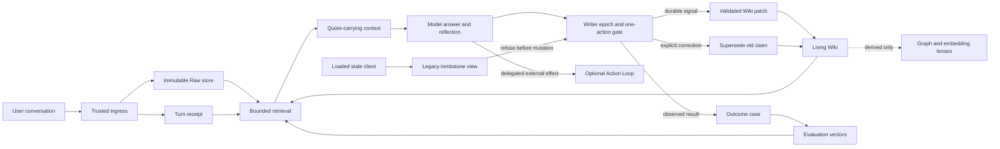

# Architecture

## 1. System boundary

LeeVault separates the cognitive loop from the action loop.

- The **Knowledge Loop** captures, retrieves, reflects, corrects, and evaluates.
- The optional **Action Loop** executes effects only under explicit bounded
  authority, idempotency, and reconciliation contracts.
- **Derived lenses** visualize or traverse knowledge but cannot write truth by
  themselves.

## 2. Core records

### Turn envelope

A trusted surface creates a current-turn envelope containing the user payload,
capture time, surface identity, and idempotency material. A model-created tool
call cannot upgrade itself into trusted user authority.

### Raw object

Raw content is content-addressed and immutable. A manifest records hash, byte
length, media type, capture time, and origin. Semantic projections never replace
the original source.

### Turn receipt

The receipt closes the model's write reach for one turn. It records which Raw
objects, candidate pages, and prior claims were actually served. A later patch
cannot cite an object that was outside that closed reach.

### Capture health receipt

A separate content-free receipt records runtime contract version, surface, mode,
success or failure, and latency. Evaluation uses a bounded current-version window;
it does not mix old-runtime, shadow, or malformed rows into release readiness.

### Source span

A claim carries a verified byte range or exact quote plus its Raw identifier and
quote hash. Mechanical verification proves that the quoted bytes exist; it does
not prove the interpretation is true.

### Living Wiki claim

A Wiki page is a mutable working projection. Claims have stable identifiers,
source spans, parent claims, status, and optional supersession links. Human prose
outside generated blocks remains untouched.

### Correction and outcome case

A correction supersedes a served claim and creates a hard regression case. An
outcome records an observed result and optional explicit user attribution such as
helped, harmed, changed-answer, or changed-decision.

## 3. Write path

1. Capture the current user bytes before model inference.
2. Store Raw and create a turn receipt idempotently.
3. Retrieve only a bounded candidate set with quotes.
4. Answer the user.
5. Reflect on the current direct-user message before finishing.
6. Write only when the message explicitly expresses a durable preference,
   decision, correction, or outcome.
7. Validate the writer epoch and one-action lease before touching a semantic
   projection.
8. Validate authority, source reach, page reach, path safety, and atomicity.
9. Update the search index incrementally; fall back to a full rebuild on drift.

One-off instructions such as “continue” or “summarize this” remain in Raw but do
not become durable Wiki claims.

### Writer epoch cutover

An application restart is not a security boundary. A client may keep an old MCP
process alive after the implementation on disk has changed. The write contract
therefore has a backward-incompatible writer epoch at the mandatory
pre-mutation signal check.

The current implementation writes semantic-action receipts to a current table.
The legacy table name becomes a read-only tombstone view that returns a retired
writer marker for every completed turn. Old code performs its existing
one-action lookup, sees the marker, and aborts before changing the Wiki. Current
code reads the new table and continues normally.

Migration preserves rows from both the legacy table and any known transitional
epoch inside one database transaction. If an ambiguous state cannot be merged
without guessing, initialization fails closed. Stale clients may still capture
Raw and retrieve context; they cannot mutate canonical claims.

## 4. Read path

Retrieval is hybrid and deliberately bounded:

1. lexical and optional semantic search produce candidates;
2. current project focus and a small recent-turn window provide continuity;
3. superseded claims are excluded from normal recall;
4. the context contains exact quotes and identifiers, not unrestricted files;
5. the model decides relevance inside the closed candidate menu.

Similarity creates candidates. It does not decide truth, authority, or page
routing by itself.

## 5. Derived lenses

Three surfaces serve different jobs:

- Markdown/Obsidian is the inspectable human surface.
- Graph tools reveal cross-document associations during intake or investigation.
- Code graphs reveal implementation dependencies and blast radius.

Their outputs are reproducible and disposable. A graph community, embedding
neighbor, or centrality score must never auto-promote a rule or fact.

## 6. Human involvement

The goal is no repetitive approval prompts, not removal of human agency.

Automatic by default:

- capture, retrieval, summarization, linking, correction, linting, indexing;
- reversible local edits within an already delegated workspace;
- bounded experiments with explicit rollback and outcome measurement.

Explicit delegation remains necessary when opening or expanding authority over:

- money or paid commitments;
- accounts, credentials, or private data access;
- public identity and publication;
- destructive or difficult-to-reconcile effects;
- legal commitments or third-party rights.

The human supplies goals, values, corrections, and root authority. The system
handles repeated execution inside that boundary.
